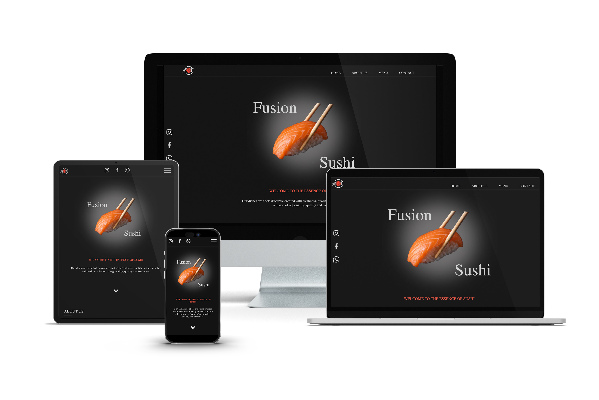

# Website of Sushi Restaurant

## About

The Fusion Sushi restaurant application was built for educational purposes, providing an example of what a potential Japanese restaurant website could look like. It includes a navigation menu with sections such as 'About Us', 'Menu' and 'Contact', allowing you to explore various aspects of the restaurant.

## Used Technologies

HTML | CSS | Javascript | GSAP | AOS Animation
